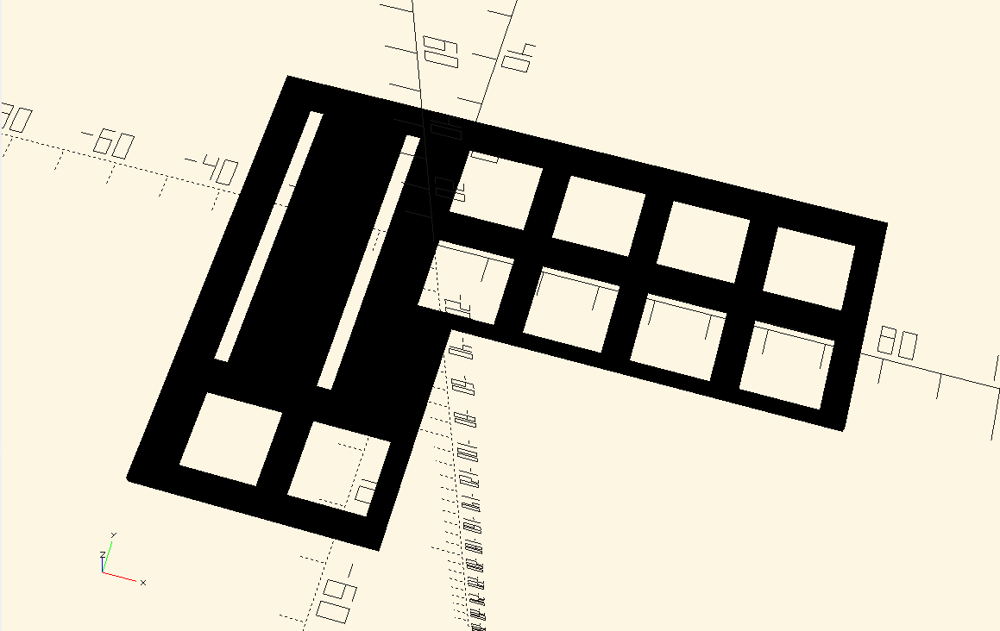
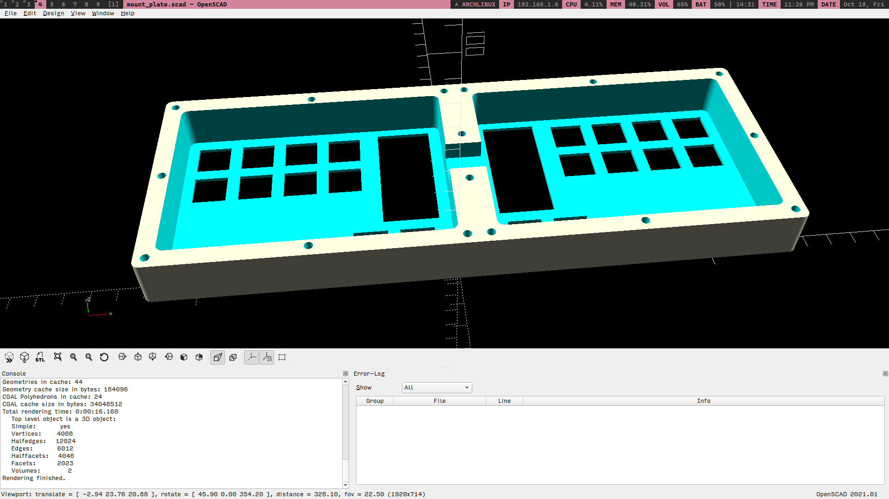
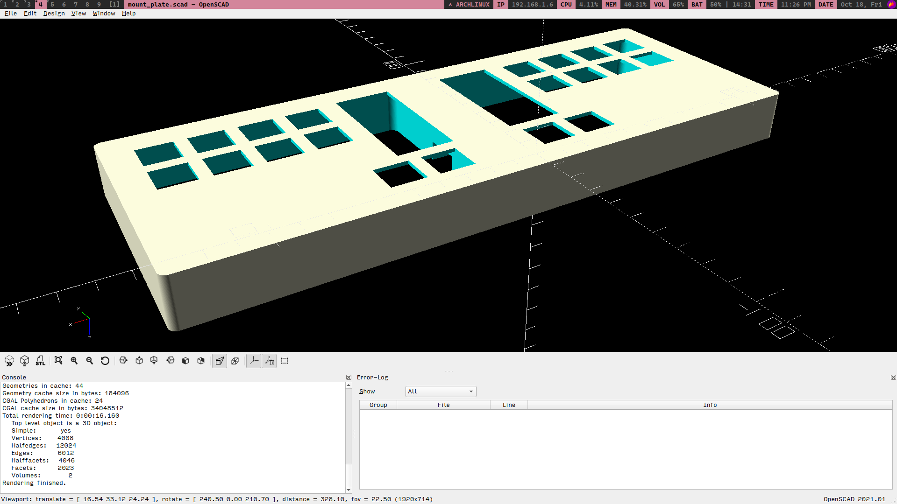
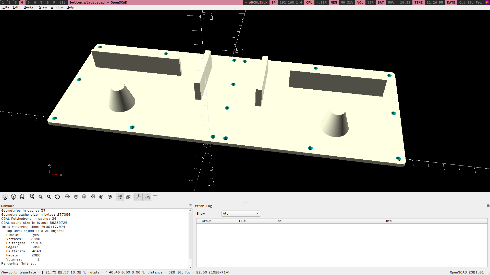
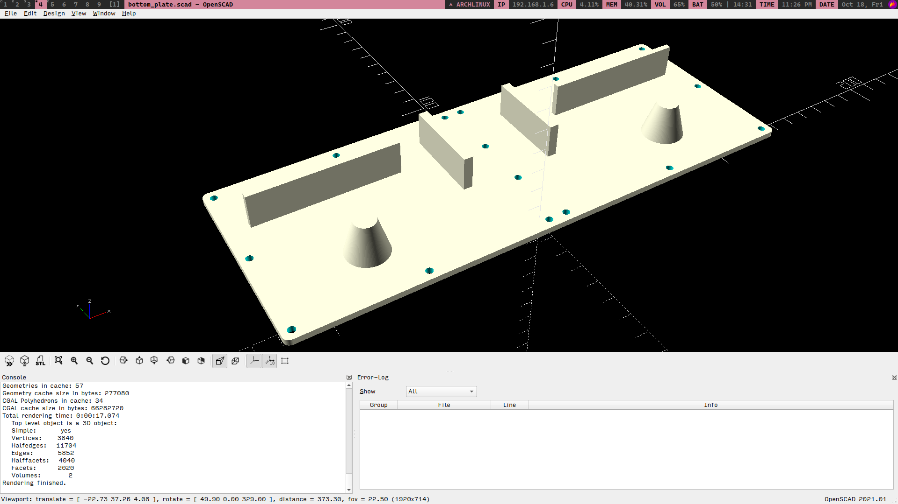
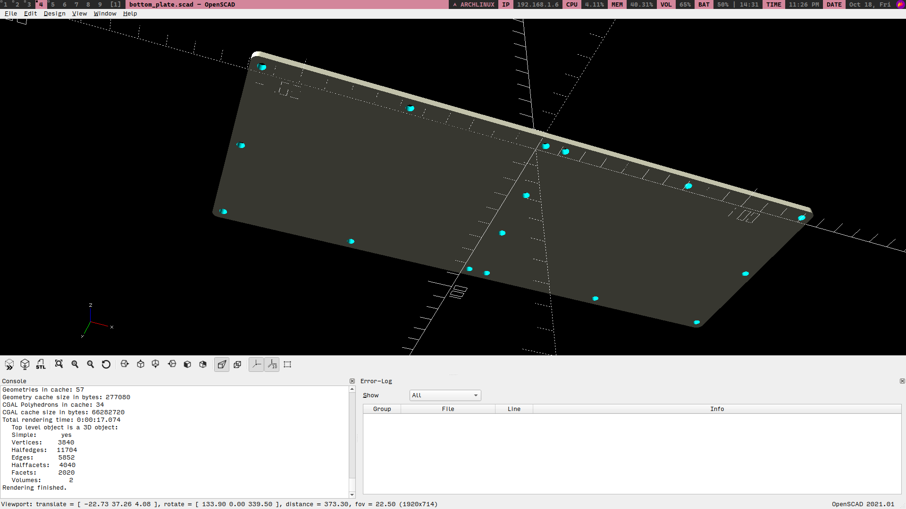

<pre>
This project is licensed under the GNU General Public License v3 (GPL-3.0).

Original Authors:
Aditya Gautam

Contributors:
-

For more information, see the LICENSE file and the GNU General Public License v3.
</pre>

# Split Ergonomic 20 Key Keyboard
> NOTE: This project is still a work in progress

  

  

## MOTIVE
- To design a HID (human interface device) which resembles a generic qwerty keyboard's functionality in the way that the user has to press buttons in order to get keypresses on the system connected to the keyboard.
- The differentiating factor I was hoping to get was the decrease in finger movement while typing through the use of combos and layers in order to improve the overall ergonomics in typing.
- I had observerd various other ergonomic split keyboard designs on [YouTube](https://youtube.com) and [Reddit](https://reddit.com), however, mostly none of those designs were kind of in the intersection of a generic keyboard and an ergonomic keyboard.
- Hence, I came to the conclusion to design my own split ergonomic keyboard.

## LOGS

### Inspiration

- [This](https://youtu.be/wTMcH7u-vu0?feature=shared) video by [Josean Martinez](https://www.youtube.com/@joseanmartinez) popped up on my YouTube feed one day and got me thinking about split ergonomic keyboards
- After further research, I came across these two wonderful channels that helped me to design my own PCB for the keyboard
    1. [Ben Vallack](https://www.youtube.com/@BenVallack)
    2. [Joe Scotto](https://www.youtube.com/@joe_scotto)

### Keyboard Designing

- I followed [Joe Scotto's](https://www.youtube.com/@joe_scotto) [video](https://youtu.be/8WXpGTIbxlQ?feature=shared) tutorial on how to design PCB using KiCad and ordered the PCB through [Robu.in](https://robu.in)
- Gerber File: [Gerber](reversible_20_gerber.zip)
- PCB: 

  

  

### Assembly ([ASSEMBLY VIDEO](https://youtu.be/sDFPSLh6BhQ?feature=shared))

  

  
  

  
  

  
  

  
- Me thinking of adding the SSD1306 oled 0.9 inch display but that idea quickly vanished since I had not planned earlier about the connectivity of the two halves, whether they will be wired or wireless and other stuff like that.

  

  
- After soldering the kailh hotswap sockets, I noticed that I had soldered half of them in the opposite direction which blocked the hole in which the switch was supposed to sit flush to the PCB.

  

  
  

  
- A lot of progress in between the previous image and this image.

    1. I soldered male to male header pins at the bottom of the right half so that I could connect jumper wires between the two halves and since I was using a single mcu, I directly assigned the left 10 switches to 10 gpio pins on the mcu on the right side

    2. My cheap tenting solution was to put this tommy hilfiger tie combo box (which was further vandalised by me because i wanted to test out this 20 key layout using push buttons before ordering the PCB) in between the two halves in order to achieve the perfect tilt angle

    3. But the current state of the keyboard wasn't doing it for me since I had not properly soldered the header pins and some edge pins were disconnecting. Hence, I went down the wireless route.

- And this was the layout I was using when both the halves were connected : [Layout](https://aditya23043.github.io/kb_layout/)

  

  
  

  
  

  

- Me trying to figure out how to make the layout work when both halves are connected independently to the system

  

  
  

  

- Left Half (Current state as of 25th July, 2024 - 11:30PM)

  

  
  

  
  

  

- Right Half (Current state as of 25th July, 2024 - 11:30PM)

  

  
  

  
  

  

### PROBLEMS

- Since this was my first custom PCB design, I ordered the first prototype I designed without further testing and thinking, and hence, I am facing problems at the assembly stage regarding core functionalities of the keyboard.
- Starting out, after the main assembly, I was still conflicted in context of connectivity.
- Initially, I started out by connecting both the halves
- As of 27th July, 10:30PM, I am still confused if I want to have a wired board or wireless or semi wireless (the halves are wired up but as a whole they are wirelessly connected to the PC)

### Nearing to Completion
- I figured, with my current knowledge alongside my research, I am unable to make both the halves of the keyboard to interact with each other wirelessly ALONGSIDE making them communicate with the system (PC/Laptop/etc..) at the same time  (as of 21/08/24 11:20PM)
- So, I figured I should connect both the halves through wires
- At the current state, both the halves are connected through 3.5mm TRRS cable
- Both the halves communicate through I2C (Inter-Integrated Circuit) protocol
- As of today, both the halves are connected to the system (PC/laptop/etc..) for power and data (sending keypresses) but once the code is finalized I am thinking of making them wirelessly connect to the system through BLE (bluetooth low energy)
- Also, as of today, I have implemented the same layout I used before : [Layout](https://aditya23043.github.io/kb_layout/) but I have not implemented the system layer yet

#### Hotswappable Switches Issue
- The switches I bought (HMX Hyacinth V2U) were a little bit loose when I put them in and out of the hotswappable socket and hence wanted to try other switches if they would stay stuck to the PCB
- I had desoldered Otemu red switches from my other 60% qwerty keyboard
- Those switches had a little bit of metal left in the pins while desoldering
- So, when I put those switches, they were perfect in fit however they made my hotswappable sockets's holes a little bit bigger and now the HMX switches would not stick to the PCB at all. Even a little bit of force would make them fall over from the PCB
- To combat this, I designed this case [./prototype_1/case/switch_plate.stl](./prototype_1/case/switch_plate.stl) for the switches to mount to

  

  
  

  
  

  
  

  
  

  
  

  

## PROTOTYPE VER 2.0
- It has been some time since the last commit
- Finished with the 1st prototype
    - In which I had connected both the halves through wire (I2C) and each of the halves were then connected through USB to the system
- But due to two mcus and constant data travel, it was a more power consuming contraption
- And due to the wires, it was a messy prototype
- So, for this version I "was" ....
- (yes, "was" because turns out im not that great at thinking ahead of time and documenting it in real time)
- ... thinking of making both the havles be kept closer to each other and i connect both of them using wire again but not any special protocol to send data from one mcu to another
- Instead, I'll directly connect all the 10 switched (+1 ground) to the one mcu on one half just like i did in the starting stages of the prototype 1 but less flimsy because I'll be using a proper 3d printed case.
- So, only one mcu required with no special communication => so less power consumption => longer lasting in terms of battery life => happy end user => YAY
- Also, all the parts where files were mentioned are now moved to `/prototype_1/`

### CASE
- No changes in the PCB
- I will be placing both the PCBs inside one case which makes them a mono-board keyboard functionally so that the wiring doesn't go haywire when actually using the board and also so that I can hide all the messy connections (if any added afterwards) inside the case
    - Trust me, you do not want to solder 1m of single core copper wire you ordered from amazon and think that it will be portable and perfectly find and won't definitely short the whole board
- The case comprises of two parts: Switch mount plate + bottom plate
- And both the parts are held together by M3x6mm countersunk Phillips screws which will be screwed into M3x6mm brass inserts which will be pushed into the switch mount plate using a soldering iron
- I bought the screws and inserts from https://onlyscrews.in for very cheap as compared to https://amazon.in

> NOTE: Gerber viewer of kicad was a very helpful tool whose measurement tool I used extensively to measure out the distances of different components on my PCB to make a near accurate estimate for my case

### [./prototype_2/mount_plate.stl](Switch Mount Plate)
- The main structure of the case
- Consists of mount plate + boundary for the case
  

  
  

  

### [./prototype_2/bottom_plate.stl](Bottom Plate)
- Covers the case from the bottom
- Will have the rubber feet stuck to the bottom for better grip on smooth surfaces
- Is 3mm in height cus why not? (besides the fact that it will cost more)
- Has standoffs so that the PCB can rest on those
- The cylindrical standoffs with different top and bottom radii are fine in context of 3d designing but I am not quite sure about the other cuboidal standoffs since they do not seem to have good structural integrity
  

  
  

  
  

  

> I am yet to order these 2 parts because I am conflicted between ordering these from https://robu.in which will take more time and cost as compared to using my college's 3d printer which will be available after 29th October, 2024 (today is 18th october btw)\
> I'll probably wait since just one 1.5mm switch mount plate (just the plate not the boundaries) in my ver 1.0 costed me about 200rs per half (~2.5$)\
> And both of the above with the minimal configuration (like 15% infill, standard nozzle, black ABS) is showing me about ~1500rs (~18$)
