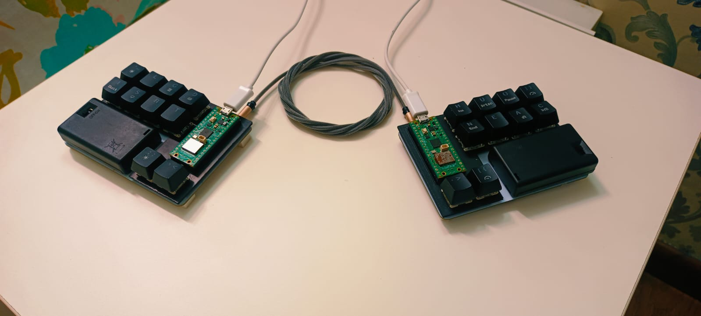
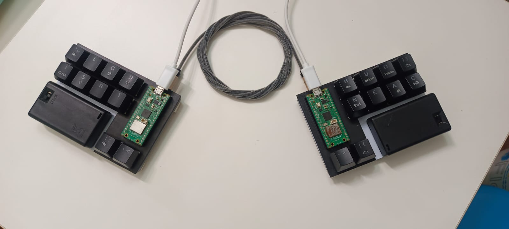
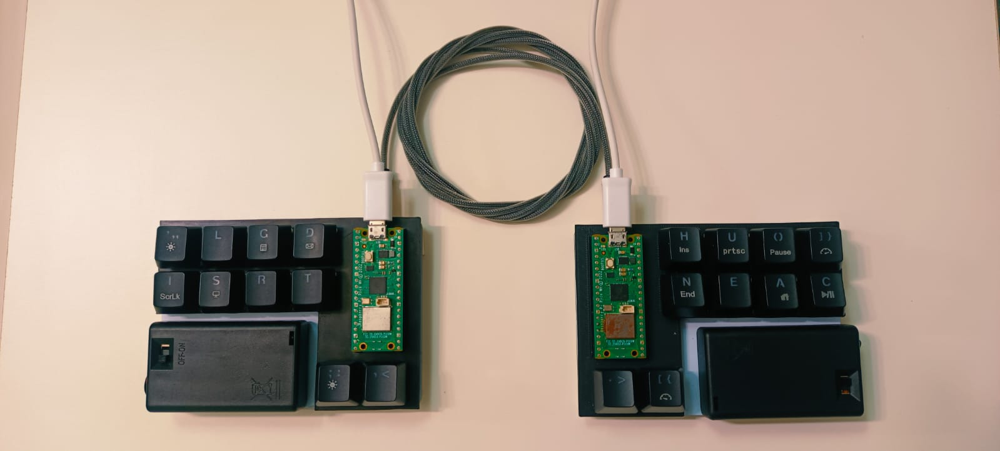
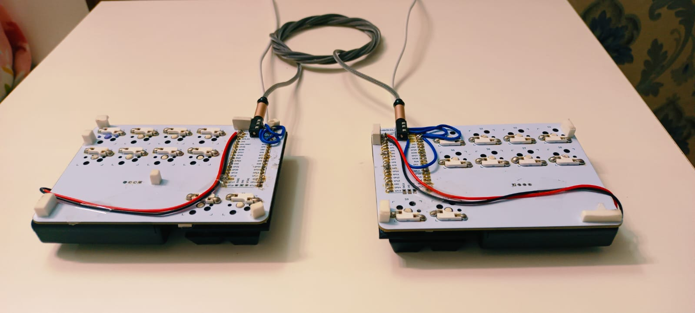
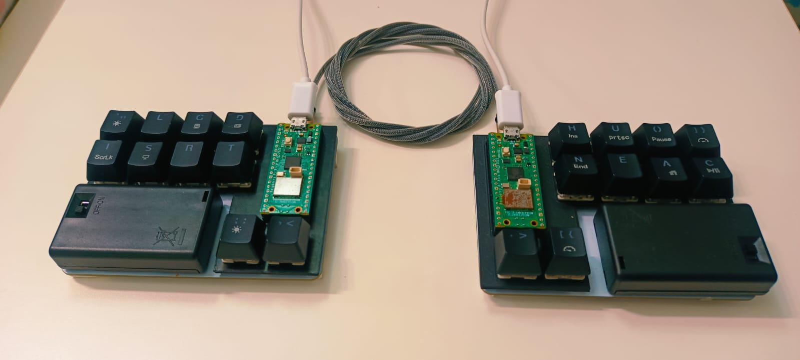

<pre>
This project is licensed under the GNU General Public License v3 (GPL-3.0).

Original Authors:
Aditya Gautam

Contributors:
-

For more information, see the LICENSE file and the GNU General Public License v3.
</pre>

# Split Ergonomic 20 Key Keyboard
> NOTE: This project is still a work in progress

  

  

## MOTIVE
- To design a HID (human interface device) which resembles a generic qwerty keyboard's functionality in the way that the user has to press buttons in order to get keypresses on the system connected to the keyboard.
- The differentiating factor I was hoping to get was the decrease in finger movement while typing through the use of combos and layers in order to improve the overall ergonomics in typing.
- I had observerd various other ergonomic split keyboard designs on [YouTube](https://youtube.com) and [Reddit](https://reddit.com), however, mostly none of those designs were kind of in the intersection of a generic keyboard and an ergonomic keyboard.
- Hence, I came to the conclusion to design my own split ergonomic keyboard.

## LOGS

### Inspiration

- [This](https://youtu.be/wTMcH7u-vu0?feature=shared) video by [Josean Martinez](https://www.youtube.com/@joseanmartinez) popped up on my YouTube feed one day and got me thinking about split ergonomic keyboards
- After further research, I came across these two wonderful channels that helped me to design my own PCB for the keyboard
    1. [Ben Vallack](https://www.youtube.com/@BenVallack)
    2. [Joe Scotto](https://www.youtube.com/@joe_scotto)

### Keyboard Designing

- I followed [Joe Scotto's](https://www.youtube.com/@joe_scotto) [video](https://youtu.be/8WXpGTIbxlQ?feature=shared) tutorial on how to design PCB using KiCad and ordered the PCB through [Robu.in](https://robu.in)
- Gerber File: [Gerber](reversible_20_gerber.zip)
- PCB: 

  

  

### Assembly ([ASSEMBLY VIDEO](https://youtu.be/sDFPSLh6BhQ?feature=shared))

  

  
  

  
  

  
  

  
- Me thinking of adding the SSD1306 oled 0.9 inch display but that idea quickly vanished since I had not planned earlier about the connectivity of the two halves, whether they will be wired or wireless and other stuff like that.

  

  
- After soldering the kailh hotswap sockets, I noticed that I had soldered half of them in the opposite direction which blocked the hole in which the switch was supposed to sit flush to the PCB.

  

  
  

  
- A lot of progress in between the previous image and this image.

    1. I soldered male to male header pins at the bottom of the right half so that I could connect jumper wires between the two halves and since I was using a single mcu, I directly assigned the left 10 switches to 10 gpio pins on the mcu on the right side

    2. My cheap tenting solution was to put this tommy hilfiger tie combo box (which was further vandalised by me because i wanted to test out this 20 key layout using push buttons before ordering the PCB) in between the two halves in order to achieve the perfect tilt angle

    3. But the current state of the keyboard wasn't doing it for me since I had not properly soldered the header pins and some edge pins were disconnecting. Hence, I went down the wireless route.

- And this was the layout I was using when both the halves were connected : [Layout](https://aditya23043.github.io/kb_layout/)

  

  
  

  
  

  

- Me trying to figure out how to make the layout work when both halves are connected independently to the system

  

  
  

  

- Left Half (Current state as of 25th July, 2024 - 11:30PM)

  

  
  

  
  

  

- Right Half (Current state as of 25th July, 2024 - 11:30PM)

  

  
  

  
  

  

### PROBLEMS

- Since this was my first custom PCB design, I ordered the first prototype I designed without further testing and thinking, and hence, I am facing problems at the assembly stage regarding core functionalities of the keyboard.
- Starting out, after the main assembly, I was still conflicted in context of connectivity.
- Initially, I started out by connecting both the halves
- As of 27th July, 10:30PM, I am still confused if I want to have a wired board or wireless or semi wireless (the halves are wired up but as a whole they are wirelessly connected to the PC)

### Nearing to Completion
- I figured, with my current knowledge alongside my research, I am unable to make both the halves of the keyboard to interact with each other wirelessly ALONGSIDE making them communicate with the system (PC/Laptop/etc..) at the same time  (as of 21/08/24 11:20PM)
- So, I figured I should connect both the halves through wires
- At the current state, both the halves are connected through 3.5mm TRRS cable
- Both the halves communicate through I2C (Inter-Integrated Circuit) protocol
- As of today, both the halves are connected to the system (PC/laptop/etc..) for power and data (sending keypresses) but once the code is finalized I am thinking of making them wirelessly connect to the system through BLE (bluetooth low energy)
- Also, as of today, I have implemented the same layout I used before : [Layout](https://aditya23043.github.io/kb_layout/) but I have not implemented the system layer yet

#### Hotswappable Switches Issue
- The switches I bought (HMX Hyacinth V2U) were a little bit loose when I put them in and out of the hotswappable socket and hence wanted to try other switches if they would stay stuck to the PCB
- I had desoldered Otemu red switches from my other 60% qwerty keyboard
- Those switches had a little bit of metal left in the pins while desoldering
- So, when I put those switches, they were perfect in fit however they made my hotswappable sockets's holes a little bit bigger and now the HMX switches would not stick to the PCB at all. Even a little bit of force would make them fall over from the PCB
- To combat this, I designed this case [case/switch_plate.stl](case/switch_plate.stl) for the switches to mount to

  

  
  

  
  

  
  

  
  

  

 
<input type="text" name="something" value="">
 

<h2 class="text_center">ALPHA LAYER 1</h2>
    
<table class="center">
    <tr>
        <td>NUM</td>
        <td>l</td>
        <td>g</td>
        <td>d</td>
        <td class="space"></td>
        <td>h</td>
        <td>u</td>
        <td>o</td>
        <td>SYS</td>
    </tr>
    <tr>
        <td>i</td>
        <td>s</td>
        <td>r</td>
        <td>t</td>
        <td class="space"></td>
        <td>n</td>
        <td>e</td>
        <td>a</td>
        <td>c</td>
    </tr>
    <tr>
        <td class="space"></td>
        <td class="space"></td>
        <td>A2</td>
        <td><-</td>
        <td class="space"></td>
        <td> ─ </td>
        <td>SYM</td>
        <td class="space"></td>
        <td class="space"></td>
    </tr>
</table>    

 
 
 

<h2 class="text_center">ALPHA LAYER 2</h2>

<table class="center">
    <tr>
        <td>Esc</td>
        <td>v</td>
        <td>w</td>
        <td>m</td>
        <td class="space"></td>
        <td>k</td>
        <td>'</td>
        <td>z</td>
        <td>"</td>
    </tr>
    <tr>
        <td>q</td>
        <td>f</td>
        <td>p</td>
        <td>b</td>
        <td class="space"></td>
        <td>j</td>
        <td>,</td>
        <td>x</td>
        <td>y</td>
    </tr>
    <tr>
        <td class="space"></td>
        <td class="space"></td>
        <td class="layer">A2</td>
        <td> </td>
        <td class="space"></td>
        <td>Caps</td>
        <td>Tab</td>
        <td class="space"></td>
        <td class="space"></td>
    </tr>
</table>    

 
 
 

<h2 class="text_center">NUMBER LAYER</h2>

<table class="center">
    <tr>
        <td class="layer">NUM</td>
        <td> </td>
        <td>+</td>
        <td>-</td>
        <td class="space"></td>
        <td>1</td>
        <td>2</td>
        <td>3</td>
        <td>4</td>
    </tr>
    <tr>
        <td> </td>
        <td> </td>
        <td>/</td>
        <td>*</td>
        <td class="space"></td>
        <td>5</td>
        <td>6</td>
        <td>7</td>
        <td>8</td>
    </tr>
    <tr>
        <td class="space"></td>
        <td class="space"></td>
        <td>=</td>
        <td>.</td>
        <td class="space"></td>
        <td>9</td>
        <td>0</td>
        <td class="space"></td>
        <td class="space"></td>
    </tr>
</table>    

 
 
 

<h2 class="text_center">SYMBOL LAYER</h2>

<table class="center">
    <tr>
        <td>/</td>
        <td>?</td>
        <td>#</td>
        <td>:</td>
        <td class="space"></td>
        <td>(</td>
        <td>)</td>
        <td>[</td>
        <td>]</td>
    </tr>
    <tr>
        <td>~</td>
        <td>_</td>
        <td>!</td>
        <td>;</td>
        <td class="space"></td>
        <td>{</td>
        <td>}</td>
        <td><</td>
        <td>></td>
    </tr>
    <tr>
        <td class="space"></td>
        <td class="space"></td>
        <td>SYM2</td>
        <td>%</td>
        <td class="space"></td>
        <td class="layer">SYM</td>
        <td> </td>
        <td class="space"></td>
        <td class="space"></td>
    </tr>
</table>    

 
 
 

<h2 class="text_center">SYMBOL LAYER 2</h2>

<table class="center">
    <tr>
        <td>`</td>
        <td>@</td>
        <td>#</td>
        <td>$</td>
        <td class="space"></td>
        <td>;</td>
        <td>'</td>
        <td>,</td>
        <td>-</td>
    </tr>
    <tr>
        <td>%</td>
        <td>^</td>
        <td>\</td>
        <td>|</td>
        <td class="space"></td>
        <td>:</td>
        <td>"</td>
        <td>.</td>
        <td>+</td>
    </tr>
    <tr>
        <td class="space"></td>
        <td class="space"></td>
        <td class="layer">SYM2</td>
        <td>&</td>
        <td class="space"></td>
        <td class="layer">SYM</td>
        <td> </td>
        <td class="space"></td>
        <td class="space"></td>
    </tr>
</table>    

 
 
 

<h2 class="text_center">SYSTEM LAYER</h2>

<table class="center">
    <tr>
        <td>≡</td>
        <td>↑</td>
        <td> </td>
        <td>Shft</td>
        <td class="space"></td>
        <td>Ret</td>
        <td>Tab</td>
        <td> </td>
        <td class="layer">SYS</td>
    </tr>
    <tr>
        <td>←</td>
        <td>↓</td>
        <td>→</td>
        <td>Ctrl</td>
        <td class="space"></td>
        <td>Caps</td>
        <td> </td>
        <td> </td>
        <td> </td>
    </tr>
    <tr>
        <td class="space"></td>
        <td class="space"></td>
        <td>Win</td>
        <td>Alt</td>
        <td class="space"></td>
        <td>Alt</td>
        <td>Win</td>
        <td class="space"></td>
        <td class="space"></td>
    </tr>
</table>    

